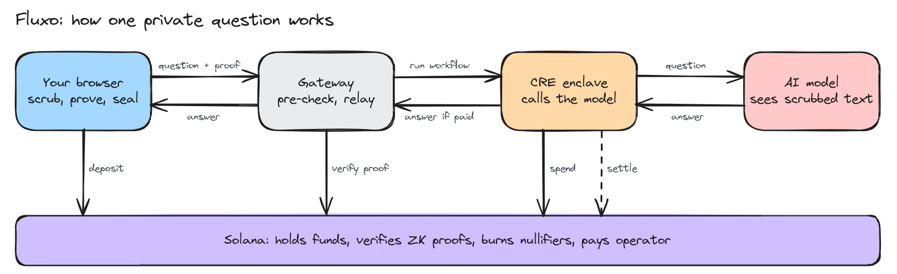

## Introduction

> **Private questions deserve private answers. Today, every AI request tells someone who you are.**

Fluxo lets people use frontier AI models privately.

A normal AI request exposes you in three places: the text you write, the payment that funds it, and the infrastructure that carries it to the model. Fluxo protects each one:

- **On-device scrubbing**: your question is scrubbed on your device and raw personal data stays in the browser.
- **Zero-knowledge credits**: you pay with zero-knowledge credits on Solana.
- **Confidential inference**: the model is called from inside a Chainlink CRE Workflow.

## Key Features

- **Two-Layer Scrubber**: A local model rewrites the question in a neutral voice. Deterministic rules then replace emails, dates, phone numbers and your known personal values, and nothing is sent until you approve the result.
- **Privacy Diff**: The user sees exactly what they typed next to exactly what will be sent, before anything leaves the device.
- **Local Re-Personalisation**: The model returns a branched answer, and the browser fills in the user's real values locally.
- **Anonymous ZK Credits**: One 10 tUSDC deposit buys 200 credits. Each question spends one credit with a Groth16 proof of owning some unspent deposit without revealing the actual one.
- **On-Chain Proof Verification**: The Solana program verifies every Groth16 proof itself, so no relayer or forwarder can create a spend.
- **Double-Spend Protection**: Every credit carries a one-time nullifier so you can't reuse one.
- **Confidential Inference**: The decrypted question, the model's answer and the API key exist only inside the CRE enclave.
- **Pay-on-Delivery**: The answer is released only after the spend is finalized on Solana, and the operator is paid only for finalized spends.

## How It Works

### 1. On-Device Scrubbing

- Runs entirely in the browser, with a local model (Ollama, `qwen3:8b`) on the user's machine.
- Layer 1: the local model rewrites the question and removes the user's writing style.
- Layer 2: rules replace emails, dates, phone numbers and known profile values, and turn an exact age into a decade.

### 2. Zero-Knowledge Credits

- **Deposit**: 10 tUSDC goes into the pool vault, and a secret commitment is inserted into a depth-10 Poseidon Merkle tree on-chain.
- **Proof**: For each question, the browser proves with `snarkjs` that it knows a commitment in a recent tree root.
- **Nullifier**: The proof exposes a one-time nullifier hash. The program records it, so the same credit can never be spent again.
- **Binding**: Each proof is bound to one specific request, so it can't be reused for a different question.

### 3. Confidential Inference

- The browser seals the scrubbed question to the enclave's public key.
- The `fluxo-request` workflow runs with `handlerInTee`. Inside the enclave it checks the binding, opens the question, calls the model with the `MODEL_API_KEY` Vault secret, and seals the answer back to the user.
- `usingTheDons()` carries only the sealed ciphertext out of the enclave.

### 4. Settlement

- `fluxo-request` finalizes the spend on Solana through `SolanaClient.writeReport` and the CRE keystone forwarder.
- `fluxo-settle` runs on a cron every 10 minutes and pays the operator 0.05 tUSDC per finalized spend.

## Architecture



For how every part works and fits together, read [`docs/ARCHITECTURE.md`](docs/ARCHITECTURE.md).

## Contract Addresses (Solana Devnet)

- **Program `fluxo_pool`**: [`HU1m8PzF8icY7FF1psP3VLDmxm9JZbCpAkByLxF3jpYC`](https://explorer.solana.com/address/HU1m8PzF8icY7FF1psP3VLDmxm9JZbCpAkByLxF3jpYC?cluster=devnet)
- **Pool PDA** (CRE simulator forwarder): `E4VujnAbw8qugcpogcSCaXVHC2r8qoAzeoAoDrnomNPT`
- **tUSDC Mint** (test token, 6 decimals): `7NfRf2AgUw3yRMSuj9EXsEJNC5nSr8RmqtrXKxv6hVFJ`
- **Tree PDA / Leaves / NullifierSet**: `J4uUU49D…` / `EfSCPTpc…` / `EMqup2tD…`
- **Vault / Operator token accounts**: `62hvjRCm…` / `Edk22EeX…`

Full addresses are in [`deploy/devnet.json`](deploy/devnet.json). The IDL is in [`deploy/idl/fluxo_pool.json`](deploy/idl/fluxo_pool.json).

## Quick Start

### Prerequisites

- CRE CLI v1.37.0 (`cre login`)
- Bun 1.2.21 or newer (older versions fail every TS workflow with `wasm unreachable`)
- Node 23
- Solana CLI 2.3.0
- Anchor 0.31.0, plus `nightly-2025-04-15` for the IDL
- circom 2.2.3 and snarkjs 0.7.6 (circuits only)
- Ollama with `qwen3:8b` (optional; without it the app runs the rules only)

### Installation

```bash
git clone https://github.com/akronim26/fluxo.git
cd fluxo

cd workflows && bun install
cd ../gateway && bun install
cd ../frontend && npm install
cd ../scripts && npm install
cd ../programs && npm install
cd ../circuits && npm ci --ignore-scripts
```

### Environment Variables

Copy each `.env.example` to `.env` in the same folder and fill it in. Nothing secret is committed.

- `workflows/.env`: a funded devnet keypair for simulation fees, your OpenRouter key and a private devnet RPC. The gateway's faucet and relayer read the RPC from here too.
- `gateway/.env`: keypair paths for the faucet (pays the 0.02 SOL), the tUSDC mint authority and the `stage_spend` relayer.
- `scripts/.env`: the admin and faucet keypairs used to set up the pool.
- `frontend/.env`: optional; the defaults work with the local gateway.

Then, from `workflows/`, create the enclave key and build the workflows:

```bash
bun run scripts/gen-enclave-key.ts   # appends SECRET_ENCLAVE_BOX_SK to .env, prints the public key
./scripts/build-wasm.sh              # compiles fluxo-request and fluxo-settle
```

### Running the App

Log in to CRE first (`cre login`), since the gateway runs the workflow through `cre workflow simulate`. Then run each in its own terminal, from the repo root:

```bash
# Gateway: public API on :8788, private mailbox on :8787
cd gateway && bun run src/server.ts

# Frontend: http://127.0.0.1:5173
cd frontend && npm run dev
```

### CRE Simulations

Run from `workflows/`. A paid question takes three steps: build the request, stage it on Solana, then run the workflow.

```bash
# Fresh pool only: deposit the test note (secret 123, nk 456) that make-request expects at leaf 0
cd ../scripts && node --env-file=.env --import tsx deposit.ts && cd ../workflows

# 1. Build a request from on-chain state, the way the browser does
#    (writes stage.json, request.json and ask.json to fixtures/requests/<id>/)
node --env-file=.env --import tsx scripts/make-request.ts --i <unused credit index> --relayer <relayer pubkey>

# 2. Stage it: stage_spend verifies the Groth16 proof on-chain
cd .. && RELAYER_KEYPAIR=<path> node --env-file-if-exists=workflows/.env \
  gateway/scripts/stage-spend.mjs workflows/fixtures/requests/<id>/stage.json deploy/devnet.json && cd workflows

# 3. Run it: TEE answer + spend finalized on Solana
cre workflow simulate ./fluxo-request --target simulation-settings --non-interactive --trigger-index 0 \
  --http-payload ./fixtures/requests/<id>/request.json --broadcast --wasm "$PWD/build/fluxo-request.wasm"

# Settle: pay the operator for finalized spends
cre workflow simulate ./fluxo-settle --target simulation-settings --non-interactive --trigger-index 0 \
  --broadcast --wasm "$PWD/build/fluxo-settle.wasm"

# Keep settling on the cron cadence (stands in for the DON scheduler)
./scripts/settle-loop.sh
```

### Solana Program

Run from `programs/`:

```bash
NO_DNA=1 anchor build --no-idl
cd programs/fluxo_pool && RUSTUP_TOOLCHAIN=nightly-2025-04-15 NO_DNA=1 \
  anchor idl build -o ../../target/idl/fluxo_pool.json -t ../../target/types/fluxo_pool.ts && cd ../..

# 17 localnet tests, including on-chain Groth16 and the forwarder CPI.
# Needs the program keypair for HU1m… at target/deploy/fluxo_pool-keypair.json
NO_DNA=1 anchor test --skip-build

# Deploy and initialise (mint, vault, large accounts, pool → deploy/devnet.json).
# Upgrading the live program needs its upgrade authority, the admin key in deploy/devnet.json
NO_DNA=1 anchor deploy --provider.cluster devnet -p fluxo_pool
cd ../scripts && node --env-file=.env --import tsx init-devnet.ts
```

## Video Link

https://vimeo.com/reviews/87cab3ae-cbf3-4d58-a16d-29b54b710d03/videos/1233770197

## Development Team

- [Soham](https://github.com/0xr10t)
- [Abhivansh](https://github.com/akronim26)
